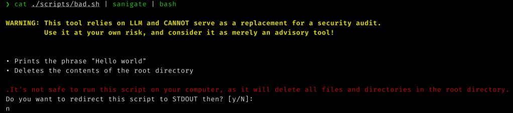
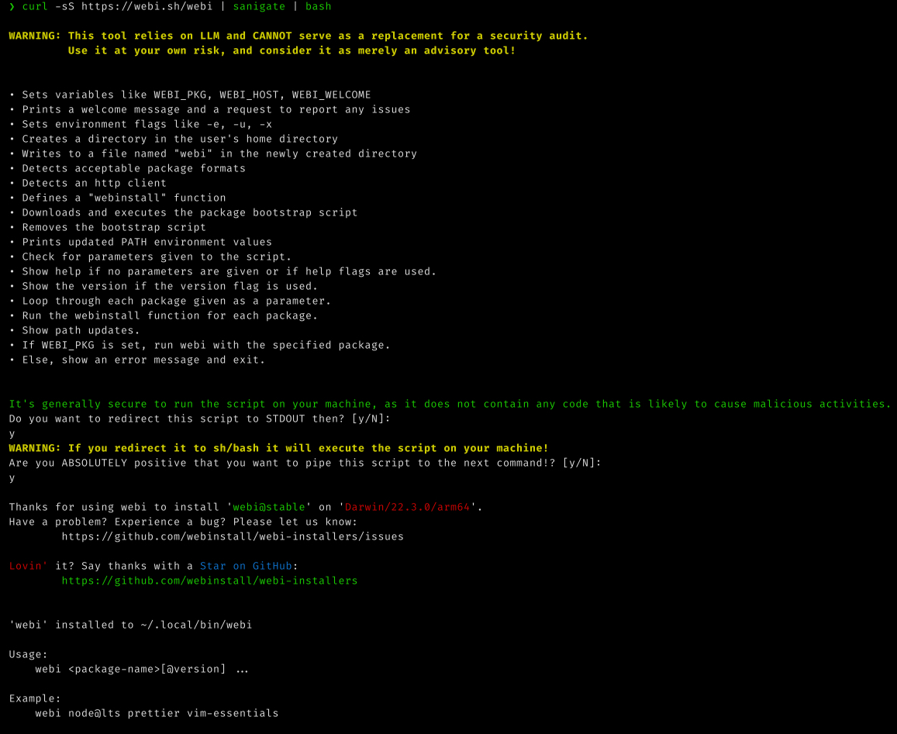
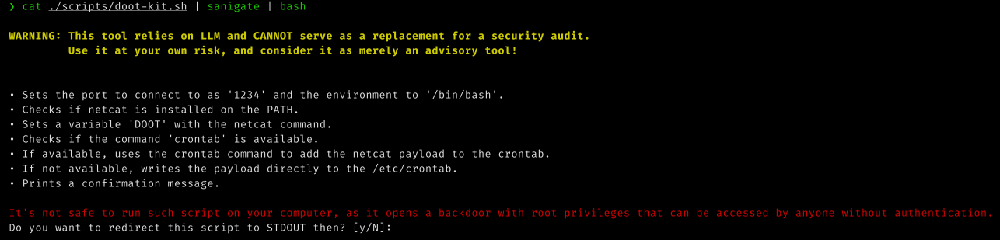

# 🐹☣️ SaniGate

<p align="center" style="background-color:#fa6925;">
  
</p>

> 🔧 **Description**: SaniGate is a sanitisation gate tool for shady shell scripts, powered by OpenAI's GPT. It lists the script actions and provides a summary of its apparent security risks.
> 
> ⚠️ **<span style="color:red">WARNING</span>**: <span style="color:red">**This app is powered by a GPT Language Model and is not infallible. It could theoretically produce opposite results for the same script. Thus, it should not be blindly trusted but used as a tool to aid in decision making.**</span>
> 
> ℹ️ **DISCLAIMER**: The tool requires [OpenAI API key](https://platform.openai.com/account/api-keys) to function. Depending on the size of the script being audited, the number of calls may vary. While this tool is free to use, usage may incur [charges from OpenAI](https://platform.openai.com/account/usage).
> 
> 🦠 **Name**: The name comes from **Sanitiz**(**-er**/**-ing**/**-isation**) Gate (aka sani-gate, Disinfection Tunnel, Sanitation Disinfection Gate, Sanitization Booth, Decontamination Chamber, Sterilization Gateway, Cleanroom Air Shower) which are disinfection chambers which typically use a combination of UV-C light and/or misting with a disinfectant solution to eliminate bacteria and viruses on surfaces and clothing.
> 
> [](https://www.codefactor.io/repository/github/smileart/sanigate) [](https://goreportcard.com/report/github.com/smileart/sanigate)

## ❓Why

It's a known[[1](https://security.stackexchange.com/questions/213401/is-curl-something-sudo-bash-a-reasonably-safe-installation-method)][[2](https://news.ycombinator.com/item?id=10277470)] security issue to run random shell scripts downloaded from the internet. 
This topic sparks a great deal of debate, with various pros and cons, comparisons of package managers, discussions on GitHub issues, and threads on Reddit. See: 🗨️ Opinions & Links section

<p align="center">
  <br />
  <a href="https://www.explainxkcd.com/wiki/index.php/1654:_Universal_Install_Script">1654: Universal Install Script Explained</>
</p>

The issue is multifaceted, and there's no one-size-fits-all solution. Even after you've checked the hashes and ensured there's no Man-in-the-Middle (MITM) attack, comprehending the entire script on your own can be notoriously challenging.

<p align="center">
  <br />
  <a href="https://www.explainxkcd.com/wiki/index.php/1168:_tar">1168: tar Explained</a>
</p>

I've contemplated a tool like this for quite a while, but solutions using bash -x script.sh or a set of heuristics for decision-making never seemed quite satisfactory. 
With the advent of the GPT family of Large Language Models (LLMs), I decided it was time to give it a try and see if it could provide a solution to this issue.

Therefore, I've created this tool, which aims to assist by analyzing shell scripts and producing a human-readable summary of their actions and an advisory conclusion regarding its safety.

## 📦 Installation

```bash
go install github.com/smileart/sanigate@latest
```
* Homebrew support coming soon. (❓)

## ☣️ Usage

The usage is fairly straightforward. You simply pipe the script through the tool, and optionally decide if you want to pass it along to the next pipe. 
Under the hood, it interacts with the OpenAI API to generate a summary of the script, identifying and summarizing its apparent security risks.

```bash
# Use your preferred method of setting the ENV var (e.g. https://direnv.net)
export SNGT_OPENAI_API_KEY="<your_openai_api_key_goes_here>"

# It's not much, but it's honest work
sanigate --help

# BEWARE: Some scripts in the ./scripts directory are malicious and are used for testing only.
#         DO NOT AGREE TO RUN THEM.
#         DO NOT RUN THEM YOURSELF!!!
cat ./scripts/CoolDude.sh | sanigate | bash
cat ./scripts/base64.sh | sanigate | sh

# This one is a false positive (GPT being paranoid, I guess)
cat ./scripts/good.sh | sanigate | sh

# This one is a tricky one (sometimes it's a false negative, although nobody wants some nasty assware on their system)
cat ./scripts/adware.sh | sanigate | bash

# Just analyse the script and don't pipe it further (notice the flag)
cat ./scripts/evil.sh | sanigate -p

# An example of a real-world script which takes really long to analyse
curl -fsSL https://get.casaos.io | sanigate | sudo bash

# An example of a normal "safe" script you might encounter and would like to run
curl -sS https://webi.sh/webi | sanigate | bash

# Another good one. The author of this one calls this installation method "gullible". Fair enough.
curl -Lsf https://sh.benthos.dev | sanigate | bash

# The piping comes in all shapes and sizes
sh -c "$(curl -fsSL https://starship.rs/install.sh | sanigate)" -y -f
sh <(curl -Ssf tea.xyz | sanigate)

# Go linters are Ok
curl -sSfL https://raw.githubusercontent.com/golangci/golangci-lint/master/install.sh | sanigate | sh -s -- -b $(go env GOPATH)/bin

# Rust seems to be pretty careful about their install scripts too
curl --proto '=https' --tlsv1.2 -sSf https://sh.rustup.rs | sanigate | sh
```

## 🧪 Example Runs

> `rm -rf /` example


> https://webinstall.dev installation example


> Backdoor example (`doot-kit.sh`)


## 🔗 Malicious Script Sources

* https://github.com/greyhat-academy/malbash
* https://github.com/jwilk/url.sh
* https://github.com/spicesouls/Malware-Dump/tree/main/Linux/Bash
* https://www.trendmicro.com/en_us/research/20/i/the-evolution-of-malicious-shell-scripts.html
* https://security.stackexchange.com/questions/134047/what-does-this-malicious-bash-script-do

## 🗨️ Opinions & Links

* https://medium.com/@ewindisch/curl-bash-a-victimless-crime-d6676eb607c9
* http://thejh.net/misc/website-terminal-copy-paste
* https://unix.stackexchange.com/questions/46286/read-and-confirm-shell-script-before-piping-from-curl-to-sh-curl-s-url-sh
* https://www.trendmicro.com/en_us/research/20/i/the-evolution-of-malicious-shell-scripts.html
* https://threatpost.com/six-malicious-linux-shell-scripts-how-to-stop-them/168127/
* https://0x46.net/thoughts/2019/04/27/piping-curl-to-shell
* https://www.arp242.net/curl-to-sh.html
* https://sysdig.com/blog/friends-dont-let-friends-curl-bash

## 💻 Development

```shell
task --watch
task release
task run
task test

gitleaks detect --source . -v
```

See: git commit message format https://www.conventionalcommits.org/en/v1.0.0/

**ToDos**:

- [ ] Write some tests
- [ ] Add and test more malicious scripts
- [ ] Make everything configurable (including prompts)
- [ ] Debug output artefacts (gaps in the list, dot in the summary, etc.) and write some fixes
- [ ] ❓ Add progress bar & context timeouts
- [ ] ❓ Create a homebrew installer
- [ ] ❓ Tweak the GPT-3 parameters and prompts to get better results (join actions and security requests into one?)

## ⚖️ License
See [LICENSE](./LICENSE.md) file.
