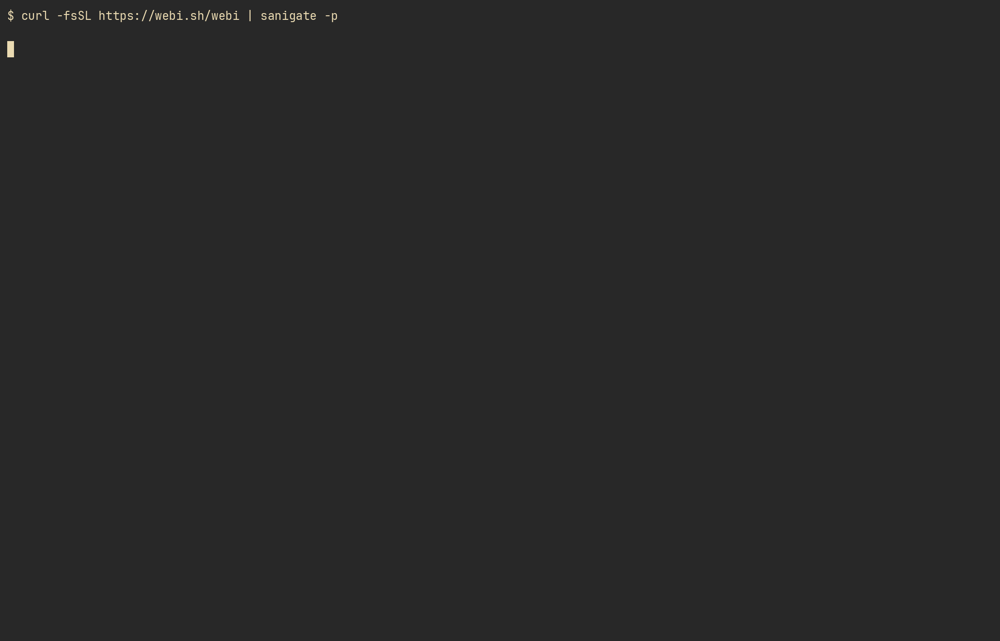
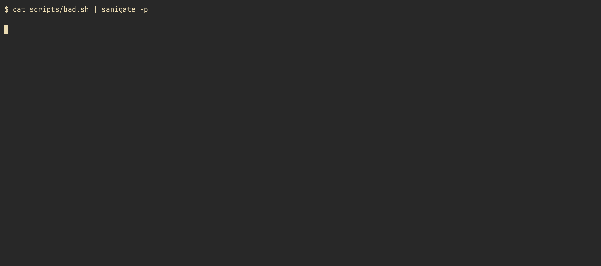
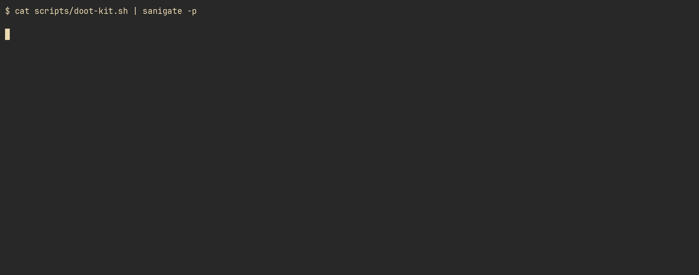

# 🐹☣️ SaniGate

<p align="center" style="background-color:#fa6925;">
  
</p>

> 🔧 **Description**: SaniGate is a sanitisation gate tool for shady shell scripts, powered by OpenAI's GPT. It lists the script actions and provides a summary of its apparent security risks.
> 
> ⚠️ **<span style="color:red">WARNING</span>**: <span style="color:red">**This app is powered by a GPT Language Model and is not infallible. It could theoretically produce opposite results for the same script. Thus, it should not be blindly trusted but used as a tool to aid in decision making.**</span>
> 
> ℹ️ **DISCLAIMER**: The tool requires [OpenAI API key](https://platform.openai.com/account/api-keys) to function. Depending on the size of the script being audited, the number of calls may vary. While this tool is free to use, usage may incur [charges from OpenAI](https://platform.openai.com/account/usage).
> 
> 🦠 **Name**: The name comes from **Sanitiz**(**-er**/**-ing**/**-isation**) Gate (aka sani-gate, Disinfection Tunnel, Sanitation Disinfection Gate, Sanitisation Booth, Decontamination Chamber, Sterilisation Gateway, Cleanroom Air Shower) which are disinfection chambers which typically use a combination of UV-C light and/or misting with a disinfectant solution to eliminate bacteria and viruses on surfaces and clothing.
> 
> [](https://www.codefactor.io/repository/github/smileart/sanigate)

## ❓Why

It's a known[[1](https://security.stackexchange.com/questions/213401/is-curl-something-sudo-bash-a-reasonably-safe-installation-method)][[2](https://news.ycombinator.com/item?id=10277470)] security issue to run random shell scripts downloaded from the internet.
This topic sparks a great deal of debate, with various pros and cons, comparisons of package managers, discussions on GitHub issues, and threads on Reddit. See: 🗨️ Opinions & Links section

<p align="center">
  <br />
  <a href="https://www.explainxkcd.com/wiki/index.php/1654:_Universal_Install_Script">1654: Universal Install Script Explained</>
</p>

The issue is multifaceted, and there's no one-size-fits-all solution. Even after you've checked the hashes and ensured there's no Man-in-the-Middle (MITM) attack, comprehending the entire script on your own can be notoriously challenging.

<p align="center">
  <br />
  <a href="https://www.explainxkcd.com/wiki/index.php/1168:_tar">1168: tar Explained</a>
</p>

I've contemplated a tool like this for quite a while, but solutions using bash -x script.sh or a set of heuristics for decision-making never seemed quite satisfactory.
With the advent of the GPT family of Large Language Models (LLMs), I decided it was time to give it a try and see if it could provide a solution to this issue.

Therefore, I've created this tool, which aims to assist by analyzing shell scripts and producing a human-readable summary of their actions and an advisory conclusion regarding its safety.

## 📦 Installation

```bash
go install github.com/smileart/sanigate@latest
```
* Homebrew support coming soon. (❓)

## ☣️ Usage

The usage is fairly straightforward. You simply pipe the script through the tool, and optionally decide if you want to pass it along to the next pipe.
Under the hood, it interacts with the OpenAI API to generate a summary of the script, identifying and summarizing its apparent security risks.

- ℹ️ Get your OpenAI API key from https://platform.openai.com/api-keys
- ℹ️ Check the usage at: https://platform.openai.com/usage

> ℹ️ **About the real-world examples below**: SaniGate judges scripts on two separate axes — **intent** (is there evidence of malice?) and **capability** (blast radius). Mainstream `curl | sh` installers (rustup, starship, devbox, casaos, webi, golangci-lint, …) are high-capability but benign, so they come back **`LEGIT, BUT POWERFUL`** (exit `0`) rather than flagged — they download and run binaries, but that's how installers work, not evidence of malice. Actual malware, with obfuscation / exfiltration / destructive commands, comes back **`suspicious`** or **`malicious`**. Distinguishing the two is the whole point. See [Two axes & exit codes](#-two-axes--exit-codes).

```bash
# Use your preferred method of setting the ENV var (e.g. https://direnv.net)
export SNGT_OPENAI_API_KEY="<your_openai_api_key_goes_here>"

# Optional: pin the model for this shell. Per-invocation override via -m / --model.
export SNGT_MODEL="gpt-4o-mini"

# It's not much, but it's honest work
sanigate --help

# Pick a different model just for this run (overrides env var and config)
cat ./scripts/good.sh | sanigate -m gpt-4o -p

# BEWARE: Some scripts in the ./scripts directory are malicious and are used for testing only.
#         DO NOT AGREE TO RUN THEM.
#         DO NOT RUN THEM YOURSELF!!!
cat ./scripts/CoolDude.sh | sanigate | bash
cat ./scripts/base64.sh | sanigate | sh

# A genuinely benign script — comes back 'SAFE' (capability: low, exit 0)
cat ./scripts/good.sh | sanigate | sh

# Adware installer — flagged 'suspicious' (exit 3): downloads a payload and registers a root LaunchAgent
cat ./scripts/adware.sh | sanigate | bash

# Just analyse the script and don't pipe it further (notice the flag)
cat ./scripts/evil.sh | sanigate -p

# A large real-world installer — slow to analyse (many chunks); benign, 'LEGIT, BUT POWERFUL' (exit 0)
curl -fsSL https://get.casaos.io | sanigate | sudo bash

# A mainstream installer (webinstall.dev) — benign 'LEGIT, BUT POWERFUL' (exit 0): fetches and runs a binary, but no malice
curl -sS https://webi.sh/webi | sanigate | bash

# Devbox is a good one (although it's a good example of a script that downloads/installs something else and runs it too)
# Which might be a huge security risk in itself (but that's a different story)
curl -fsSL https://get.jetify.com/devbox | sanigate | bash

# Another good one. The author of this one calls this installation method "gullible". Fair enough.
curl -Lsf https://sh.benthos.dev | sanigate | bash

# The piping comes in all shapes and sizes
sh -c "$(curl -fsSL https://starship.rs/install.sh | sanigate)" -y -f
sh <(curl -Ssf tea.xyz | sanigate)

# A reputable tool installer — benign 'LEGIT, BUT POWERFUL' (exit 0), even though it curls a binary and runs it
curl -sSfL https://raw.githubusercontent.com/golangci/golangci-lint/master/install.sh | sanigate | sh -s -- -b $(go env GOPATH)/bin

# Rustup is careful and well-written — benign 'LEGIT, BUT POWERFUL' (exit 0), and a great example of a loooooong, multi-chunk one
curl --proto '=https' --tlsv1.2 -sSf https://sh.rustup.rs | sanigate | sh

# Pulumi (IaC) — another mainstream installer that downloads and runs a binary; benign 'LEGIT, BUT POWERFUL'
curl -fsSL https://get.pulumi.com | sanigate | sh
```

### 🚦 Two axes & exit codes

SaniGate rates a script on two **separate** axes, so a powerful-but-legitimate installer doesn't get lumped in with malware:

- **intent** — is there *evidence of malice*? `benign` / `suspicious` / `malicious`. Downloading and running an official binary is `benign` even though it's powerful; `malicious` is reserved for red flags (obfuscation, exfiltration, security-tool tampering, hidden persistence, destructive commands, or behaviour that contradicts the stated purpose).
- **capability** — *blast radius* if it wanted to do harm: `low` / `medium` / `high`.

The headline combines them: `SAFE` (benign, low/medium capability), **`LEGIT, BUT POWERFUL`** (benign, high capability — the typical installer), `SUSPICIOUS`, or `DANGEROUS`.

Above the verdict, SaniGate prints a yellow **`Danger:`** list of concrete risk factors to weigh before running — even for a benign script (e.g. *downloads and executes a binary without verifying a checksum*, *needs root*, *pipes remote content into a shell*). It's the "legit, but here's what could still bite you" section, separate from the red flags that signal actual malice.

The **exit code is keyed to intent only** — capability never raises it, so an installer exits `0`:

| Code | Intent | Headline |
|---|---|---|
| `0` | benign | `SAFE` or `LEGIT, BUT POWERFUL` |
| `3` | suspicious | `SUSPICIOUS` |
| `4` | malicious | `DANGEROUS` |
| `1` | — | operational error (missing/invalid key, empty input, API failure) |
| `2` | — | usage error (bad flag) |

Each axis takes the worst value across the whole-script conclusion and every individual chunk, and SaniGate fails closed — an unparseable or unknown intent is treated as `malicious`, unknown capability as `high`. Because a pipe doesn't short-circuit on exit status, `… | sanigate | bash` still runs the downstream shell after the double confirmation; the exit code is there for your own scripting, e.g. analysis-only gating that lets legit installers through but stops malware:

```bash
cat ./install.sh | sanigate -p && echo "no malice detected" || echo "flagged (exit $?)"
```

## ⚙️ Configuration

On the first real run, SaniGate creates a TOML config file at a standard per-OS location:

| OS | Path |
|---|---|
| macOS | `~/Library/Application Support/sanigate/config.toml` |
| Linux | `$XDG_CONFIG_HOME/sanigate/config.toml` (defaults to `~/.config/sanigate/config.toml`) |
| Windows | `%AppData%\sanigate\config.toml` |

The auto-generated file ships with both keys **commented out**, so the in-binary defaults apply until you uncomment something:

```toml
# SaniGate config
# WARNING: this file may contain your OpenAI API key.
# Do NOT commit it to git or sync it to Dropbox/iCloud/etc.
# SaniGate enforces mode 0600 on POSIX systems.

# model = "gpt-4o-mini"
# api_key = "sk-..."  # SNGT_OPENAI_API_KEY env var takes precedence
```

### Precedence

| Setting | Resolution order |
|---|---|
| Model | `--model` / `-m` flag → `SNGT_MODEL` env → `config.model` → built-in default (`gpt-4o-mini`) |
| API key | `SNGT_OPENAI_API_KEY` env → `config.api_key` |

The asymmetry is intentional: secrets are environment concerns (CI / direnv / 1Password inject env vars), behaviour is a human concern (`-m` for ad-hoc runs). There is no `--api-key` flag — that would put a secret in shell history.

### ⚠️ Secret hygiene

If you choose to put your API key in the config file rather than the env var:

- **Do not commit it.** The file is per-user, not per-project.
- **Do not store it in synced folders** (Dropbox, iCloud, OneDrive). Cloud-synced secrets are exfiltration risk.
- On POSIX, SaniGate refuses to load the file if its mode allows group/other read. Fix with `chmod 0600 <path>` if it complains.
- The file is created with mode `0600` and the directory with `0700` automatically on first run.

### Default model bump

This release switches the default from `gpt-3.5-turbo` to `gpt-4o-mini` (cheaper per token, more capable, supports structured outputs). To pin the previous behaviour, uncomment and set `model = "gpt-3.5-turbo"` in the config.

> ℹ️ SaniGate asks the model for a **structured JSON verdict** (explicit `intent` and `capability` fields — see [Two axes & exit codes](#-two-axes--exit-codes)) rather than parsing prose, which is why the model must support structured outputs. It runs at `temperature = 0` for reproducible verdicts. On startup it does a best-effort capability check against the community [models.dev](https://models.dev) registry (cached under your OS cache dir) and prints a warning if the configured model isn't known to support structured outputs or rejects a `temperature` parameter (e.g. the `o1`/`o3` series). The check never blocks: an unknown or brand-new model just proceeds, and the OpenAI API remains the source of truth.

## 🧪 Example Runs

The two axes in action — a legitimate installer reads as **`LEGIT, BUT POWERFUL`** with its real caveats surfaced under **Danger**, while malware is flagged **`DANGEROUS`**. (GIFs regenerated via [`tapes/record.sh`](./tapes/record.sh).)

> A real installer (webinstall.dev) — benign but powerful, with a Danger breakdown
> `curl -fsSL https://webi.sh/webi | sanigate -p`


> `rm -rf /` — malicious
> `cat scripts/bad.sh | sanigate -p`


> A netcat/cron backdoor (doot-kit.sh) — malicious
> `cat scripts/doot-kit.sh | sanigate -p`


## 🔗 Malicious Script Sources

* https://github.com/greyhat-academy/malbash
* https://github.com/jwilk/url.sh
* https://github.com/spicesouls/Malware-Dump/tree/main/Linux/Bash
* https://www.trendmicro.com/en_us/research/20/i/the-evolution-of-malicious-shell-scripts.html
* https://security.stackexchange.com/questions/134047/what-does-this-malicious-bash-script-do

## 🗨️ Opinions & Links

* https://medium.com/@ewindisch/curl-bash-a-victimless-crime-d6676eb607c9
* http://thejh.net/misc/website-terminal-copy-paste
* https://unix.stackexchange.com/questions/46286/read-and-confirm-shell-script-before-piping-from-curl-to-sh-curl-s-url-sh
* https://www.trendmicro.com/en_us/research/20/i/the-evolution-of-malicious-shell-scripts.html
* https://threatpost.com/six-malicious-linux-shell-scripts-how-to-stop-them/168127/
* https://0x46.net/thoughts/2019/04/27/piping-curl-to-shell
* https://www.arp242.net/curl-to-sh.html
* https://sysdig.com/blog/friends-dont-let-friends-curl-bash

## 💻 Development

```shell
task --watch
task release
task run
task test

# Build the binary and run it against every fixture in ./scripts, asserting each
# verdict via the exit code (good.sh must be safe; the rest must flag). Reads the
# key from SNGT_OPENAI_API_KEY or the config file.
./run-scripts.sh                 # all fixtures
./run-scripts.sh good.sh bad.sh  # a subset

gitleaks detect --source . -v
```

See: git commit message format https://www.conventionalcommits.org/en/v1.0.0/

**ToDos**:

- [x] ~~Write some tests~~ — pure verdict logic (intent/capability aggregation, exit codes, labels) and the models.dev registry lookup are unit-tested; `./run-scripts.sh` asserts end-to-end verdicts. (API-mocking layer still a TODO.)
- [ ] Add and test more malicious scripts
- [ ] Make everything configurable (including prompts)
- [ ] ❓ Add progress bar & context timeouts
- [ ] ❓ Create a homebrew installer
- [x] ~~Tweak the parameters and prompts to get better results (join actions and security requests into one?)~~ — actions + security are now one structured call per chunk, at `temperature = 0`
- [x] ~~Debug output artefacts (gaps in the list, dot in the summary, etc.)~~ — resolved by structured output; the regex post-processing layer is gone

## ⚖️ License
See [LICENSE](./LICENSE.md) file.
